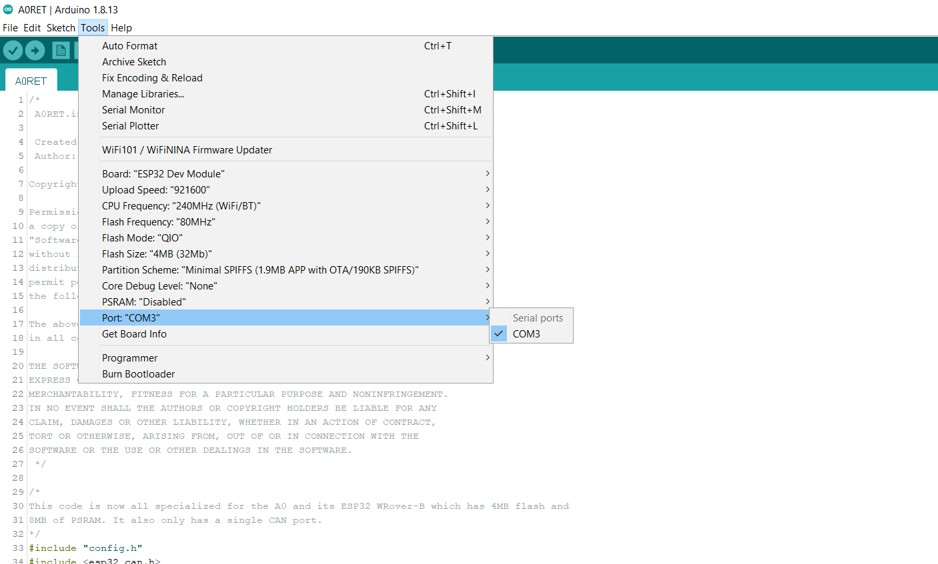
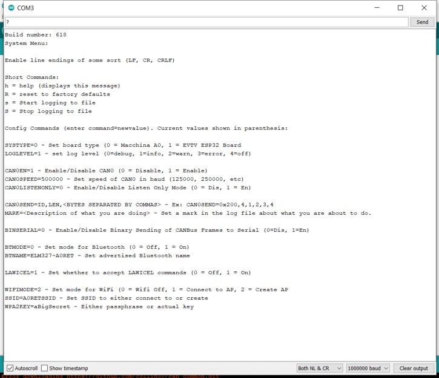

# Firmware Reference

## Introduction to ESP32RET

#### What is ESP32RET?

ESP32RET is the name of the firmware that comes pre-loaded on your new Macchina A0. ESP32RET stands for ESP32 (based) Reverse Engineering Tool and provides two primary functionalities\*: ELM327 emulation for use with apps like Torque, and Wi-Fi based connection to SavvyCAN.

_\*These functionalities are current as of version 0.1, however future versions may have expanded features._


_Note: there was a previous version called A0RET that you might still see references to in code, documentation, etc._


#### ELM327 Emulation, Explained Extra Efficiently&#x20;

Why would you want to emulate an ELM327 device? ELM327 is a closed-source black box interpreter chip (a PIC with some firmware) and you'd much rather know exactly what is being sent to and from your car, right?

Another answer is that now you can take advantage of the numerous existing, (semi) working and tested applications out there for every platform.

#### SavvyCAN&#x20;

A _Super Powerful_ CAN bus reverse engineering and capture tool written by Collin Kidder. Wireless Car Hacking!

## LED Color Codes

* RED - Not connected (In WIFIMODE=2 you are creating an AP with the A0, so it will go green immediately because you're the AP)
* Green - Ready to connect to application&#x20;
* Blue - Connected to application
* Purple - Update mode&#x20;

## Smartphone apps&#x20;

A0 should be compatible with any ELM327 based app.&#x20;

**Android** -  Torque Lite can be found at the link below:



Search the Google play store for more options.&#x20;

**iOS** - Software version 14 of iOS breaks support for A0. We are working to regain iOS support. For those interested in testing on 13 or older make sure your app settings are:&#x20;

* Connection = WiFi
* IP address = 192.168.4.1
* OBD2 adapter port = 1000

#### Other ELM based software


Visit this page for an extensive list of software compatible with ELM327, and by extension ESP32RET.


## A0 System Menu

Many low level configurations can be done via a Serial Terminal (Real-Term, Tera Term, Arduino Serial Monitor, etc). This includes turning ON and OFF WIFI and Bluetooth, setting CAN speed, and setting the WIFI password.&#x20;

Here is the system menu:

```
Short Commands: 
h = help (displays this message) 
R = reset to factory defaults 
s = Start logging to file 
S = Stop logging to file

Config Commands (enter command=newvalue). Current values shown in parenthesis:

SYSTYPE=0 - Set board type (0 = Macchina A0, 1 = EVTV ESP32 Board 
LOGLEVEL=1 - set log level (0=debug, 1=info, 2=warn, 3=error, 4=off)

CAN0EN=1 - Enable/Disable CAN0 (0 = Disable, 1 = Enable) 
CAN0SPEED=500000 - Set speed of CAN0 in baud (125000, 250000, etc) 
CAN0LISTENONLY=0 - Enable/Disable Listen Only Mode (0 = Dis, 1 = En)

CAN0SEND=ID,LEN, - Ex: CAN0SEND=0x200,4,1,2,3,4 
MARK= - Set a mark in the log file about what you are about to do.

BINSERIAL=0 - Enable/Disable Binary Sending of CANBus Frames to Serial (0=Dis, 1=En)

BTMODE=0 - Set mode for Bluetooth (0 = Off, 1 = On) 
BTNAME=ELM327-A0RET - Set advertised Bluetooth name

LAWICEL=1 - Set whether to accept 
LAWICEL commands (0 = Off, 1 = On)

WIFIMODE=2 - Set mode for WiFi (0 = Wifi Off, 1 = Connect to AP, 2 = Create AP 
SSID=A0RETSSID - Set SSID to either connect to or create 
WPA2KEY=aBigSecret - Either passphrase or actual key
```

To enter A0 System Menu using the Arduino IDE Serial Monitor, follow these steps:

1. If you don't already have the Arduino IDE installed, download and install the Arduino IDE from [here](https://www.arduino.cc/en/software).&#x20;
2. Connect A0 to your computer with a USB cable (A0's LED should turn green)&#x20;
3. Open Arduino IDE.&#x20;
4. Select the port (port numbers change frequently, your port number will likely be different than the one pictured).



Open an Arduino Serial Monitor: (button in the upper right corner)&#x20;


Set your baud rate to 1000000 if it is not already&#x20;

Send a question mark (?) to open the Menu&#x20;



On the left is the current setting. On the right in parentheses are the options. For example, BTmode=0 means Bluetooth is currently off. Send "BTmode=1" in the top line to turn it on. Send another ? to make sure the change was made.&#x20;

## Re-Flashing ESP32RET&#x20;

ESP32RET is the firmware shipped pre-loaded on A0, follow these steps to return it back to that state.

1. Download the below Zip file
2. Extract the files
3. Plug A0 into your computer via USB&#x20;
4. Run the correct file for your computer
   1. PC - Updater.bat
   2. MAC - Updater.sh
   3. Linux - Updater.command
5. A green light should appear on the A0


A0 Firmware Flash File


To compile the code yourself, find everything for ESP32RET here:&#x20;



Feel free to make improvements, submit pull requests and post issues!

## Putting your own code on A0 (using Arduino IDE)


This removes the preinstalled ESP32RET


#### Using Arduino to install your own sketch

The following steps are needed to get started programming on the Macchina A0 with the Arduino IDE:

1. Install the Arduino Desktop IDE
2. Install the Macchina A0 Board Configuration
3. Build and upload a sketch

#### Arduino Desktop IDE

Follow the official installation instructions for your operating system then return here to continue with Macchina A0 specific setup.

* [Windows](https://www.arduino.cc/en/Guide/Windows)
* [macOS](https://www.arduino.cc/en/Guide/MacOSX)
* [Linux](https://www.arduino.cc/en/Guide/Linux)

#### Board Definition


Before using Arduino IDE with A0 for the first time, you must follow the instructions in the link below to add ESP32 board definitions.




#### Flashing A0

1. Make sure any dependent libraries are in your Arduino>Libraries folder
2. Connect A0 to your computer via a micro USB cable
3. In "Tools" set the Port&#x20;
4. Select "ESP32 Dev Module" as board type
5. Upload a sketch
6. Press upload

Attached is a simple sketch "ColorPallette" for blinking the LED on A0 and the required "FastLED" Library (both need to be unzipped).&#x20;


ColorPallette Sketch



FastLED Library&#x20;


