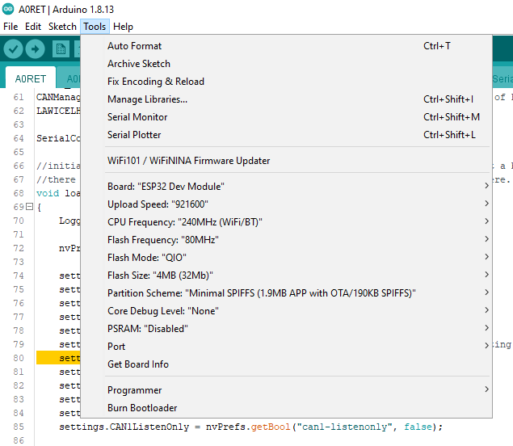
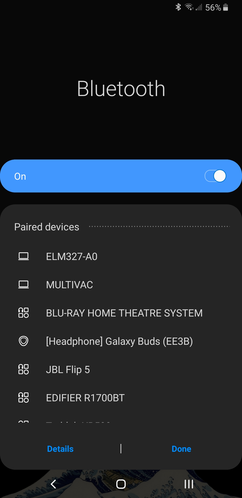

# A0RET

#### Torque Download

Torque Lite for Android can be found [HERE](https://play.google.com/store/apps/details?id=org.prowl.torquefree&hl=en_US)

Torque is currently only available on Android, however many ELM327 compatible apps exist for iOS.

#### Sketch

Find the A0RET repo at [THIS LINK](https://github.com/collin80/A0RET), download the entire repo as a .zip and extract to a folder called A0RET. Open A0RET.ino with Arduino IDE. 

#### Enable Bluetooth

On line 80 of A0RET.ino, change false to true to enable Bluetooth by default \(for connecting with Torque\).

#### Upload Settings

Ensure your settings match those shown below before uploading. \(These should all be correct by default except for Partition Scheme\)

#### Connect via Bluetooth

Using your phone's Bluetooth settings, connect to ELM327-A0.

#### Configure Torque

Enter the settings in Torque, and then the "OBD2 Adapter Settings". Ensure connection type is set to Bluetooth and then select ELM327-A0 under the "Choose Bluetooth Device" option.

#### 

#### Done!

After this point consult the [**Torque Wiki**](https://torque-bhp.com/wiki/Main_Page) to learn how to use Torque.

