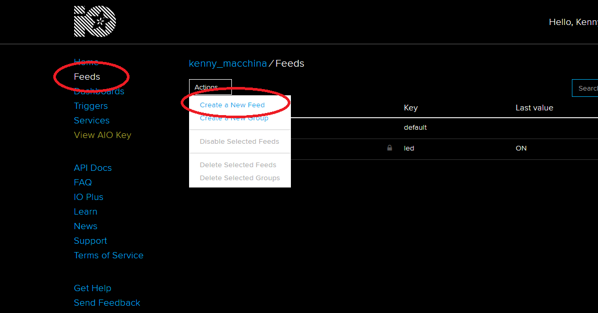
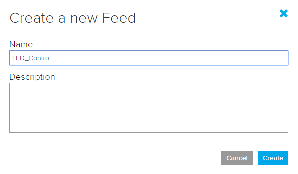
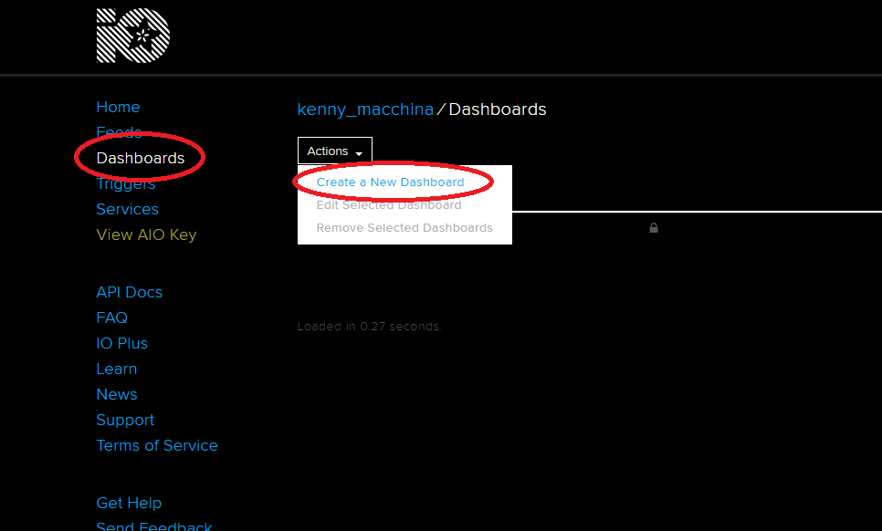
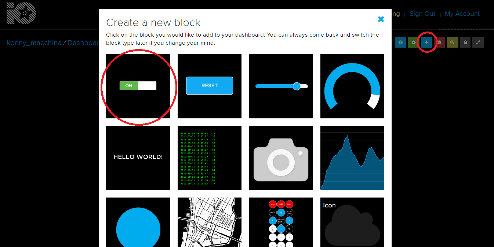
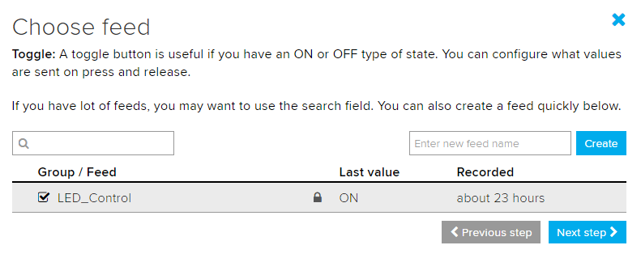
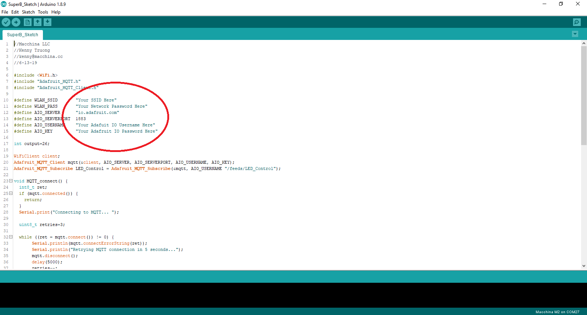
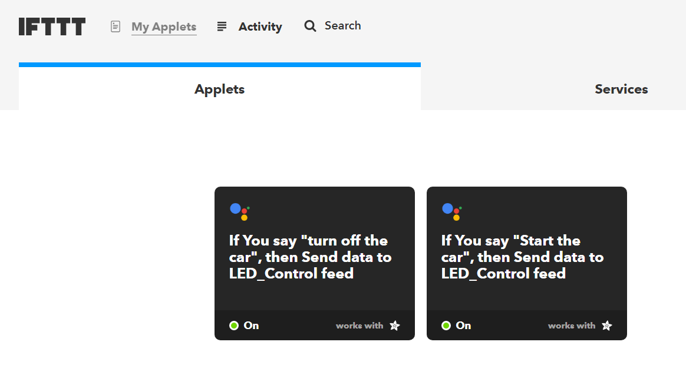
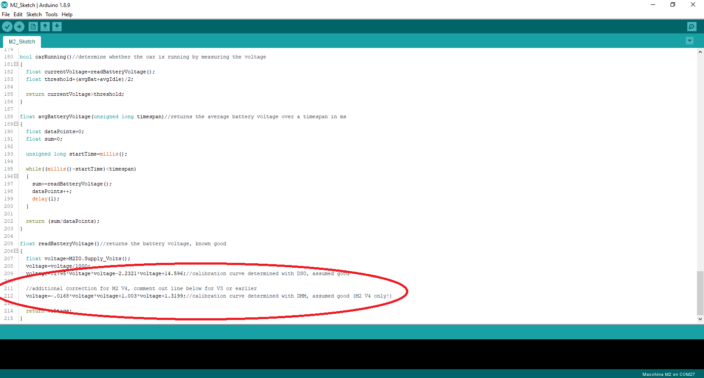
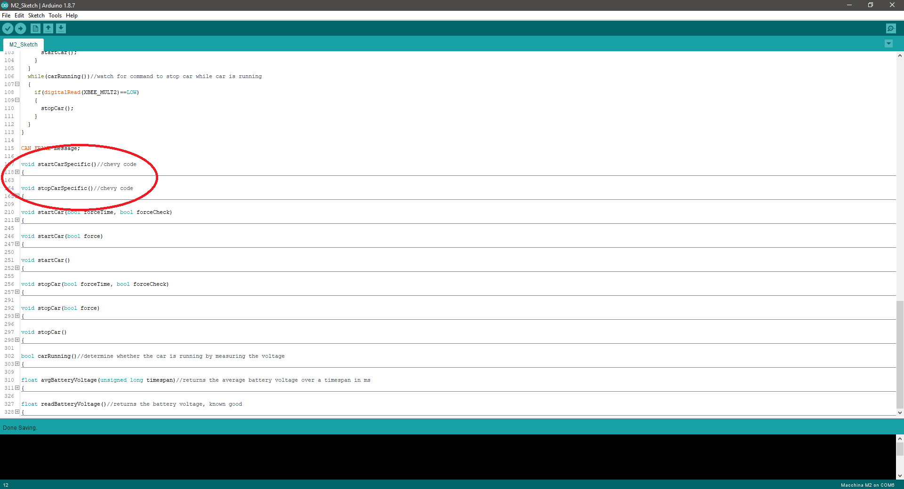

# "OK Google, start my car!"



**Hardware Needed:**

* [M2](https://www.macchina.cc/catalog/m2-boards/m2-under-dash)
* [SuperB](https://www.macchina.cc/catalog/m2-accessories/superb)
* Smartphone with Google Assistant
* GM Vehicle (GM CAN messages provided, you'll need to find your own for non-GM vehicles)

**Services Needed:**

* Google Assistant
* [If This then That (IFTTT)](https://ifttt.com/join)
* [Adafruit IO](https://io.adafruit.com/)

## Theory

* Voice commands will be given to either a smartphone or a Google Home device
* Voice data is passed to Google Assistant
* Google Assistant then triggers IFTTT with either an ON or OFF command
* IFTTT in turn updates Adafruit IO with the ON or OFF command
* SuperB receives the ON or OFF command and updates itself to reflect the new state
* M2 reads the ON/OFF state of SuperB and then starts or stops the car

### Implications, Expansion

* Other than Google Assistant, IFTTT supports a huge number of triggers. (e.g. weather, connect/disconnect from Wi-Fi networks, time, etc.) For example, have your car warm up before leaving for work if the temperature is below a certain threshold.
* Because the smartphone and SuperB are never directly connected, commands can be sent to the vehicle as long as both devices have an internet connection, regardless of the physical distance between them.

## Google Assistant

You'll need either a smartphone capable of accessing Google Assistant or a Google Home device. In either case, make sure you know the credentials of the Google account associated with the device.

## If This then That (IFTTT)

If This then That will handle the exchange between Google Assistant and Adafruit IO, and adds the option to use a trigger other than a voice command. Register for an account [here.](https://ifttt.com/join) Make sure to link the same Google account used on your smartphone or Google Home.

## Adafruit IO

Adafruit IO is an easy to use web service that can control internet enabled hardware (like M2 and SuperB). IO provides a virtual dashboard accessible through a web browser onto which all manner of gauges, sliders, buttons, and switches can be placed. For our purposes we'll have a dashboard with a simple ON/OFF switch, the state of which the SuperB will be able to read. What makes IO extremely useful is that these switches can be controlled by other web services like IFTTT, and not just through the web dashboard. Register for an account [here.](https://io.adafruit.com/)

## Step 1: Set up Adafruit IO

Create a new feed titled "LED\_Control". (case-sensitive!)

&#x20;

Create a new dashboard with any title.

Navigate to the new dashboard and place a toggle switch linked to the "LED\_Control" feed. Leave the block settings on their default settings.

There should now be a single toggle switch on the dashboard:

Find and record your username and key, which will be necessary later.

## Step 2: Set up and Test SuperB

Download the SuperB sketch [here.](https://github.com/kenny-macchina/Ok-Google-Start-My-Car/tree/master/SuperB\_Sketch) (This sketch uses the Adafruit MQTT library which can be installed through the Arduino library manager)

Update the sketch with your Adafruit IO and Wi-Fi credentials.

To flash SuperB with M2 follow the instructions [here.](http://docs.macchina.cc/superB/flashing/arduinoM2.html) Alternatively, if you have an XBee USB adapter board you can flash SuperB using the instructions found [here.](http://docs.macchina.cc/superB/hardware.html#use-xbee-usb-adapter-to-flash)

Power on SuperB (either with an M2 or USB adapter board) and use the Adafruit IO dashboard to test the functionality. &#x20;

## Step 3: Set up and Test IFTTT

Create a new applet with Google Assistant as the trigger (the "this"). &#x20;

Select Adafruit IO as the action (the "that"). Connect your Adafruit account to IFTTT if prompted. Select the "LED\_Control" feed and enter "ON" (case-sensitive) as the data to save to the feed. &#x20;

In the same style create another applet to turn the car off, sending "OFF" instead of "ON".

With these 2 applets you should now be able to control the toggle switch on your IO dashboard via Google Assistant.

Great! At this point we can toggle a pin on SuperB using Google Assistant. The final step is to have M2 read the pin state and then perform an action on the car accordingly. &#x20;

If you're interested in using more than just one pin the SuperB pinout can be found [here,](../../product-documentation/superb-docs/hardware.md) and the pinout for the M2's XBee socket can be found [here.](../../product-documentation/m2-docs/detailed-reference/pin-mapping.md#xbee)

## Step 4: Flash M2

Download the M2 sketch [here.](https://github.com/kenny-macchina/Ok-Google-Start-My-Car/tree/master/M2\_Sketch)

This sketch uses the M2\_12VIO library found [here,](https://github.com/TDoust/M2\_12VIO) the pwm library found [here,](https://github.com/antodom/pwm\_lib) and the mcp2515 library found [here,](https://github.com/macchina/Single-Wire-CAN-mcp2515) make sure you have them installed.

Determine which version of M2 you have [here.](../../product-documentation/m2-docs/versions.md) Comment out the V4 specific line in the readBatteryVoltage() function if you have V3 or earlier, otherwise leave the code as is.

The startCarSpecific() and stopCarSpecific() functions are pre-populated with GM specific CAN messages. You'll have to determine what CAN messages to send for other cars. (This may take some work to determine!)

